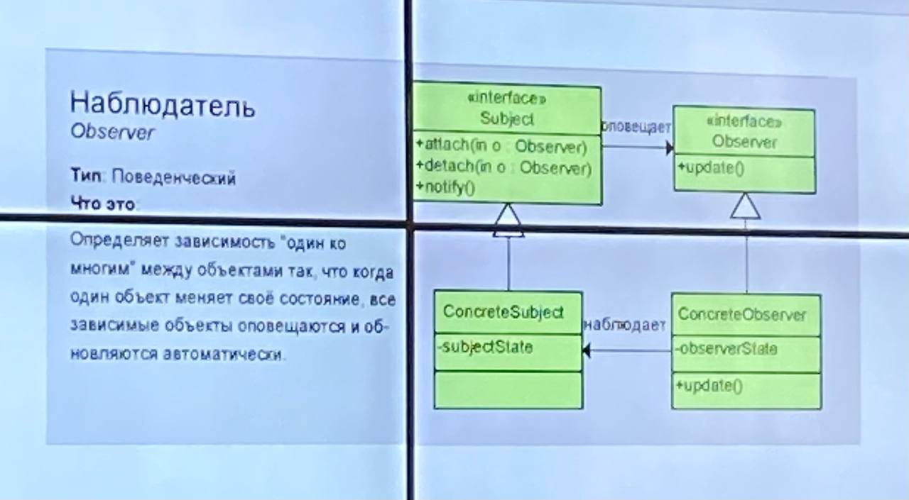
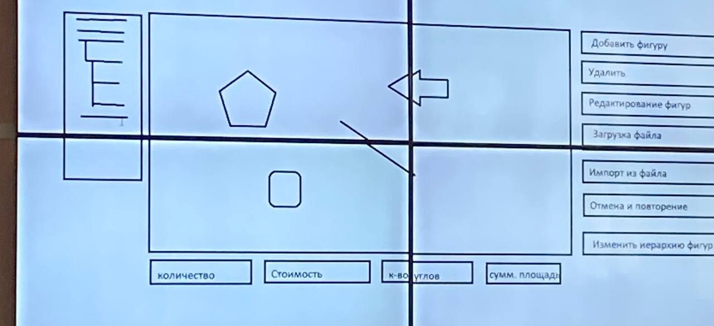
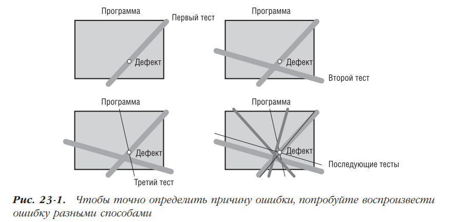

# Методичка к экзамену

## Содержание

1. [Антипаттерны: Copy&Paste, спаггети-код](#1-антипаттерны-copypaste-спаггети-код)
2. [Антипаттерны: Магические числа, Hard Code, ненужная сложность](#2-антипаттерны-магические-числа-hard-code-ненужная-сложность)
3. [Препроцессор-компилятор-компоновщик](#3-препроцессор-компилятор-компоновщик)
4. [C++11: Список инициализации, лямбда-функции](#4-c11-список-инициализации-лямбда-функции)
5. [C++11: auto, цикл for по коллекции](#5-c11-auto-for-по-коллекции)
6. [Google Code Guide: Страж включения, зависимости](#6-google-code-guide-страж-включения-зависимости-в-заголовочных-файлах)
7. [Google Code Guide: Встроенные функции, порядок параметров](#7-google-code-guide-встроенные-функции-порядок-параметров)
8. [Google Code Guide: Конструкторы, перегрузка функций, классы](#8-google-code-guide-конструкторы-перегрузка-функций-классы)
9. [Шаблоны проектирования: Фабричный метод](#9-шаблоны-проектирования-определение-назначение-фабричный-метод)
10. [Шаблоны проектирования: Пул объектов](#10-шаблоны-проектирования-определение-назначение-пул-объектов)
11. [Шаблоны проектирования: Наблюдатель](#11-шаблоны-проектирования-определение-назначение-наблюдатель)
12. [Отладка программ: Научный метод](#12-отладка-программ-научный-метод-отладки)
13. [Отладка программ: Поиск дефектов](#13-отладка-программ-поиск-дефектов)
14. [Отладка программ: Метод грубой силы](#14-отладка-программ-отладка-методом-грубой-силы)
15. [Рефакторинг: Определение, причины](#15-рефакторинг-определение-причины)
16. [Рефакторинг: Определение, примеры](#16-рефакторинг-определение-примеры)

## 1. Антипаттерны: Copy&Paste, спаггети-код
**Антипаттерн** — шаблон неэффективного решения задачи.

### Copy&Paste
**Определение**: Создание кода с часто повторяющимися частями.
**Последствия**:
  - Дубликат кода усложняет восприятие программы и размножает ошибки из оригинала;
  - Усложнение исправления ошибок, так как изменения нужно вносить во всех копиях.

**Решение**:
  - Код-ревью;
  - Принцип DRY (Don't Repeat Yourself) — вынос общей логики в функции или классы;
  - Рефакторинг.

**Пример антипаттерна**:
```cpp
int sumInt(const vector<int>& vec) {
    int sum = 0;
    for (int num : vec)
        sum += num;
    return sum;
}

double sumDouble(const vector<double>& vec) {
    double sum = 0.0;
    for (double num : vec)
        sum += num;
    return sum;
}

void main() {
    vector<int> intVec = {n values};
    vector<double> doubleVec = {n values};
    cout << "Sum int: " << sumInt(intVec) << endl;
    cout << "Sum double: " << sumDouble(doubleVec) << endl;
    return 0;
}
```

**Пример исправления**:
```cpp
template <typename T>
T sum(const vector<T>& vec) {
    T sum = T();
    for (const T& num : vec)
        sum += num;
    return sum;
}

void main() {
    vector<int> intVec = {n values};
    vector<double> doubleVec = {n values};
    cout << "Sum int: " << sum(intVec) << endl;
    cout << "Sum double: " << sum(doubleVec) << endl;
}
```
### Спаггети-код
**Определение**: Сложный для понимания, слабо структурированный код.
**Причины**:
  - Множество связей (вложенные конструкции, goto, friend );
  - Неявные зависимости.

**Пример**:
```cpp
void f(int a, int b, int _x) {
    if (_x) {
        // another operation;
    } else {
        // another operation;
    }
}

void main() {
    f(1, 2, x);
    // something
    f(1, 2, x);
}
```

## 2. Антипаттерны. Магические числа, hard code, ненужная сложность 
### Магические числа
**Определение**: Использование числовых констант в коде.
**Пример**:
```cpp
int a = x * 8;
int b = c + 8;
float f = 34.593f;
float x = a * 34.6f;
```

**Пример исправления**:
```cpp
const int NUM_ELEMENTS = 8;
const int NUM_BITS = 8;
const int ARRAY_SIZE = 10;
const float FVALUE = 34.59f;
// также можно использовать другой метод
const int NUM_BITS_INT = sizeof(int) * 8;
```

### Hard code
**Определение**: Внедрение конкретных значений в код, вместо их вынесения в конфигурационные файлы, константы или базу данных.
**Последствия**: усложнение поддержки и изменение программы.
**Пример (условный)**:
```cpp
void connectToDB() {
    string host = "127.0.0.1";
    int port = 5432; //новость дня, postgres по умл предлагает вашу бд установить на этот порт
    string user = "admin";
    string password = "dayahuyznaet";
}

void main() {
    connectToDB();
}
```

**Пример исправления** (смысл в выносе настроек в конфиг или иное окружение, а затем их подключить):
```cpp
// у нас например есть какое нибудь окружение, БД, есть метод getenv, который может обращаться к окружению
void connectToDatabase() {
    const char* host = getenv("DB_HOST");
    const char* portStr = getenv("DB_PORT");
    const char* user = getenv("DB_USER");
    const char* password = getenv("DB_PASS");
}

void main() {
    connectToDatabase();
} 
// смысл в том, чтобы данные не находились в исходниках
```

### Ненужная сложность (неоправданно универсальное решение)
**Определение**: Намеренно усложненный код.
**Причины**:
  - Избыток абстракций, классов, паттернов;
  - Ненужные уровни наследования;
  - Гибкое решение там, где возможен простой код.

**Пример**:
```cpp
// из проблем: 2 класса для простой проверки, виртуальный метод и динамическая память
class NumberValidator {
public:
    virtual bool validate(int) = 0;
    virtual ~NumberValidator() {}
};

class EvenNumberValidator : public NumberValidator {
public:
    bool validate(int num) override {
        return num % 2 == 0;
    }
};

void main() {
    NumberValidator* validator = new EvenNumberValidator();
    cout << validator->validate(4);
    delete validator;
}
```

**Пример решения**:
```cpp
bool isEven(int num) {
    return num % 2 == 0;
}

void main() {
    cout << isEven(4);
}
```

## 3. Препроцессор-компилятор-компоновщик
**Препроцессор** - программа для обработки текста. Он преобразует данные в соответствии с директивами препроцессора. Если данные не содержат директив препроцессора, то они остаются без изменений. Препроцессор может существовать как отдельная программа, так и быть интегрированным в компилятор.
**Компилятор** - программа, которая переводит исходный код в инструкции процессора (как объектный файл, на схеме указано). При синтаксических ошибках объектный файл не создается.
**Компоновщик** - на слэнге это линкер. Это программа, производящая линковку, сборку. Он принимает на вход один или несколько модулей и собирает по ним исполнимый модуль.

В общем, это этапы процесса трансляции исходника в виде текстового файла в представлении, которое может быть выполнено процессором.

**Сборка компоновщика**
Всем известно, что сборка программы происходит за счет другой специальной программы - компоновщика. Роль компоновщика определяет размещение программы в памяти (ну распределение памяти в общем), также настраивает адреса в памяти: относительные адреса заменяются абсолютными адресами распределенной памяти.


## 4. C++11. Список инициализации, лямбда функции
### Список инициализации
**Определение**: единый синтаксис инициализации переменных, контейнеров и объектов с помощью {}.
**Преимущества**:
  - Универсальность (работает для всех типов: примитивы, массивы, классы, контейнеры);
  - Ограничение преобразования (например: double -> int без явного приведения);
  - Устранение неоднозначности при вызове конструкторов.

**Пример**:
```cpp
int x{5};
double y{3.14};     

int arr[]{1, 2, 3};               
vector<int> vec{10, 20, 30}; 

class Point {
public:
    int x, y;
    Point(int a, int b) : x{a}, y{b} {}
};
Point p{1, 2};
```

**Существует особенность**, если тип имеет <code>initializer_list</code> в конструкторе, то вызов происходит предпочтительно:
```cpp
vector<int> v{5}; // один элемент, равный 5
vector<int> v(5); // 5 элементов, равных 0
```

### Лямбда функция
**Определение**: Такая функция, которую можно объявить непосредственно в месте использования (то есть объявляем и используем на лету). Также ее можно передавать в качестве параметра (пример с алгоритмом).
**Пример 1**:
```cpp
// пример с простой лямбдой
vector<int> v = {1, 3, 5, 2, 4, 1, 5, 7, 4, 9, 3, 4};

for_each(
    v.begin(), 
    v.end(), 
    [](int x){cout << x << ' ';} // если что, то вот она
);
// у нее прикольный прикол, что используется на лету, а также, до этого момента, нестандартное начало объявления, где [] - захват переменной, смотри пример ниже. 
```

**Пример 2**:
```cpp
// пример с захватом переменной
vector<int> v = {1, 3, 5, 2, 4, 1, 5, 7, 4, 9, 3, 4};
int summ = 0;
for_each(
    v.begin(), 
    v.end(),
    [&summ](int x){
        cout << x << ' ';
        summ += x;
    }
);
// [x] - захват по значению;
// [&x] - захват по ссылке.
```

**Пример 3**:
```cpp
vector<int> nums{1, 2, 3, 4};
sort(nums.begin(), nums.end(), [](int a, int b) { return a > b; });
// в методе sort лямбда функция передается в качестве параметра.
```

## 5. C++11. auto, for по коллекции
### auto
**Определение (из дипсика)**: механизм автоматического вывода типа переменной на этапе компиляции.
**Преимущества**:
  - упрощает код (в особенности с итераторами);
  - Уменьшает вероятность ошибок при изменении типов;
  - Работает с шаблонами и лямбда функциями.

**Пример**:
```cpp
auto x = 5; // int
auto y = 3.14; // double
auto z = "Hello"; // const char*

vector<int> vec{1, 2, 3};
auto it = vec.begin(); // с этим каждый встречался не раз -> vector<int>::iterator

template <typename T, typename U>
auto add(T a, U b) -> decltype(a + b) {
    return a + b;
}
auto result = add(2, 3.5); // double
```

В ней также есть прикол, что она требует явной инициализации, то есть просто объявить <code>auto x;</code> не получится, нужно указать значение. Двигаясь от C++20, auto можно использовать в передаваемых параметрах функций (код с дипсика ясно дает это понять). 

### for по коллекции
** Определение**: Упрощенный синтаксис для итерации по контейнерам. 
**Преимущества**:
  - Избавляет от ручного управления итератором (все же надеюсь помнят);
  - Работает с любым типом, имеющий begin() и end();
  - Поддерживает auto для краткости.

**Пример**:
```cpp
//цикл for по коллекции
vector<int> v = {1, 2, 3};

for(auto it = v.begin(); it != v.end(); ++it)
    cout << *it << ' ';

cout << endl;

for(vector<int>::iterator it = v.begin(); it != v.end(); ++it)
    cout << *it << ' ';

cout << endl;

for(int& i : v) //тот самый цикл for по коллекции в короткой записи
    cout << i << ' ';
/* объявляем тип итератора по коллекции, и саму коллекцию, 
работает с контейнерами у которых есть метды begin() и end(),
и их методы должны возвращать итератор.
с апперсантом i может менять значения контейнера, а без & просто для вывода.
auto упрощает запись, при этом необходимо знать что за тип,
и есть ли смысл упрощать запись */
```

## 6. Google Code Guide. Страж включения, зависимости в заголовочных файлах
### Страж включения
**Определение**: условно это техника предотвращения множественного включения одного заголовочного файла в проект.
**Как работает**: использует директивы препроцессора <code>#ifndef, #define, #endif</code> для блокировки повторного включения.
**Пример:**  
```cpp
#ifndef MATRIX_H
#define MATRIX_H

class Matrix { /*...*/ };

#endif  // MATRIX_H
```

Для C++11 существует альтернатива: <code>#pragma once</code>.
Это может быть важным, потому что возможно исключение ошибок переопределения функций и классов, а также исключает повторную обработку кода, что ускоряет компиляцию.

### Зависимости в заголовочных файлах
**Определения нет, но**: не используйте <code>#include</code>, если достаточно предварительного объявления. Это в общем минимизирует зависимости, также можно включать только то, что нужно для объявления в заголовке.
**Как разделяются зависимости**:
  - Заголовочные файлы: только объявления, без реализации;
  - Исходные файлы: полные <code>#include</code> для реализации.

**Пример**:
```cpp
// какой нибудь My.h
#ifndef MY_H
#define MY_H
class X;
class Y {
    X* x;
public:
    Y();
    ~Y();
};
#endif
```
```cpp
// My.cpp
#include "My.h"

Y::Y(){x = new X();}
Y::Y(){delete x;}
void main(){}
```

## 7. Google Code Guide. Встроенные функции, порядок параметров
### Встроенные функции
**Что это?**: Функции, объявленные с ключевым словом `inline`, тело которых подставляется в месте вызова (а не вызывается как отдельная функция).
**Причины использования**:
  - Маленькие функции (1-3 строки);
  - Часто вызываемые функции (например, геттеры/сеттеры);
  - Функции в заголовочных файлах (во избежание ошибок линковки).

**Правила GCG**:
- Избегайте `inline` для сложных функций (> 10 строк);
- Не используйте `inline` для виртуальных функций (компилятор может проигнорировать);
- В классах: методы, определенные внутри класса, неявно становятся `inline`.  

**Пример**:
```cpp
inline void f() {
    // here for 3 rows code
}
// если в теле функции >3 строк, то это косяк для inline функции по GCG
```

| Плюсы | Минусы |
|-------|--------|
|Уменьшение накладных расходов на вызов функции|Увеличение размера бинарника (при условии, что функция вызывается много раз)|
|Подходит для шаблонных функций (они должны быть в заголовках)||

### Порядок параметров функции
**Рекомендации GCG**:
- Входные параметры перед выходными:
  - Сначала параметры, которые читаются, затем те, которые изменяются.
- Единый порядок во всем проекте.
- Параметры с дефолтными значениями должны находиться в конце.

**Пример правильного порядка**:
```cpp
// входные параметры a, b перед выходными result
void calculate(int a, int b, int& result);
```
**Пример с необязательными параметрами**:
```cpp
// необязательный параметр в конце
void drawCircle(int x, int y, int radius, Color color = Color::Black);
```
**Пример для классов**:
```cpp
class Player {
public:
    // this неявно считается первым параметром
    // напомню, что такое this - указатель на текущий объект данного класса
    void move(int dx, int dy); // dx, dy — входные параметрыуказатель на текущий объект данного класса
};
```

 ## 8. Google Code Guide. Конструкторы, перегрузка функций, классы
 ### Конструкторы
**Основные правила:**
1. **Явные конструкторы:**
   - Помечайте конструкторы с одним параметром как `explicit` (запрещает неявные преобразования)
```cpp
class String {
public:
    explicit String(int size); // запрещает String s = 10;
};
```

2. **Делегирующие конструкторы (C++11):**
```cpp
class Circle {
public:
    Circle() : Circle(1.0) {} // делегирует конструктору с параметром
    explicit Circle(double r) : radius(r) {}
};
```

3. **Инициализация членов класса:**
   - Использование списка инициализации вместо присваивания в теле конструктора.
```cpp
Point::Point(int x, int y) : x_(x), y_(y) {}
```

### Перегрузка функций
**Рекомендации:**
1. **Четкие различия:**
   - Перегружайте только когда варианты логически выполняют одну задачу.
```cpp
void print(int value);
void print(const string& value);
```

2. **Избегание двусмысленности:**
```cpp
void process(int x);
void process(double x); // может вызвать неоднозначность при process(5)
```

3. **Параметры по умолчанию vs перегрузка:**
   - Использование перегрузки, когда логика существенно отличается.
```cpp
// лучше две функции:
void connect();
void connect(const string& url);
// чем одна с параметром по умолчанию:
void connect(const string& url = "");
```

### Классы
**Стиль GCG:**
1. **Порядок объявления**:
```cpp
class MyClass {
public: // условный API для пользователей
protected: // для наследников
private: // внутренняя реализация
};
```

2. **Инкапсуляция:**
   - Члены класса должны быть `private` по умолчанию;
   - Используйте геттеры/сеттеры только когда необходимо.
3. **Размер классов:**
   - Избегайте "божественных классов" (god objects);
   - Разделяйте ответственность между несколькими классами.
4. **Наследование:**
   - Композиция предпочтительнее наследования.

**Пример неправильного класса**:
```cpp
class BadExample {
public:
    BadExample(int x) { data = x; } // неявное присваивание
    
    void process(int x); // слишком общее название
    void process(); // совсем другая логика
    
    int data; // публичное поле
};
```

**Пример правильного класса**:
```cpp
class Rational {
public:
    explicit Rational(int numerator, int denominator = 1);
    
    int numerator() const { return num_; }
    int denominator() const { return den_; }
    
    Rational operator+(const Rational& other) const;

private:
    int num_;
    int den_;    
};
```

## 9. Шаблоны Проектирования. Определение, назначение. Фабричный метод
**Шаблоны проектирования** - это хорошее решение типовой задачи, возникающей при разработке.
**Назначение**:
- Повышение повторной используемости кода;
- Упрощение поддержки и модификации системы;
- Снижение вероятности ошибок;
- Ускорение процесса разработки.

### Фабричный метод (Factory Method)
**Относится к**: Порождающим шаблонам, а то есть он создает объекты. Также он использует наследование (делегирование создания подклассам).
**Назначение**:
- Определяет интерфейс для создания объекта;
- Позволяет подклассам изменять тип создаваемых объектов.

**Пример фабричного метода**:
```cpp
class DocumentCreator {
public:
    virtual Document* createDocument() = 0;
    virtual ~DocumentCreator() {}
};

class PDFCreator : public DocumentCreator {
public:
    Document* createDocument() override {
        return new PDFDocument();
    }
};

class WordCreator : public DocumentCreator {
public:
    Document* createDocument() override {
        return new WordDocument();
    }
};

DocumentCreator* creator = new PDFCreator();
Document* doc = creator->createDocument();
```

|Преимущества|Недостатки|
|------------|----------|
|Избегает жёсткой привязки к конкретным классам|Усложнение кода (необходимость создания параллельной иерархии классов)|
|Упрощает добавление новых типов продуктов|Требует предварительного проектирования|
|Реализует принцип открытости/закрытости||

**Применение:**
- Когда система должна оставаться независимой от типов создаваемых объектов;
- Когда нужно предоставить возможность расширения для будущих подклассов;
- В библиотеках и фреймворках.

## 10. Шаблоны Проектирования. Определение, назначение. Пул объектов
**Шаблоны проектирования** - это хорошее решение типовой задачи, возникающей при разработке.
**Назначение**:
- Повышение повторной используемости кода;
- Упрощение поддержки и модификации системы;
- Снижение вероятности ошибок;
- Ускорение процесса разработки.

### Пул объектов
**Суть шаблона**: Шаблон нужен для повторного использования объектов вместо их постоянного создания и уничтожения. 
**Относится к**: Порождающим шаблонам

**Суть проблемы**:
1. Частое создание/удаление "тяжёлых" объектов (например, подключений к БД)
2. Высокая стоимость инициализации объектов
3. Фрагментация памяти

**Пример:**
 ```cpp
// предварительное создание и кэширование объектов
class ConnectionPool {
private:
    stack<DatabaseConnection*> pool;
    mutex poolMutex;
    
public:
    DatabaseConnection* acquire() {
        lock_guard<mutex> lock(poolMutex);
        if (pool.empty()) {
            return new DatabaseConnection();
        }
        auto* conn = pool.top();
        pool.pop();
        return conn;
    }
    
    void release(DatabaseConnection* conn) {
        lock_guard<mutex> lock(poolMutex);
        pool.push(conn);
    }
    
    ~ConnectionPool() {
        while (!pool.empty()) {
            delete pool.top();
            pool.pop();
        }
    }
};

ConnectionPool pool;
auto* conn = pool.acquire();
conn->executeQuery("...");
pool.release(conn);
 ```

**Особенности:**
- Экономия времени на создании объектов;
- Снижение нагрузки на сборщик мусора;
- Контроль над количеством экземпляров.

|Преимущества|Недостатки|
|------------|----------|
|Экономия времени на создании объектов|Усложнение кода|
|Снижение нагрузки на сборщик мусора|Необходимость ручного управления объектами|
|Контроль над количеством экземпляров|Риск "утечки" объектов (если не вернуть в пул)|

## 11. Шаблоны Проектирования. Определение, назначение. Наблюдатель
**Шаблоны проектирования** - это хорошее решение типовой задачи, возникающей при разработке.
**Назначение**:
- Повышение повторной используемости кода;
- Упрощение поддержки и модификации системы;
- Снижение вероятности ошибок;
- Ускорение процесса разработки.

### Наблюдатель (Observer)

**Относится к**: Поведенческим шаблонам
**Суть проблемы**:
- Необходимость уведомления множества объектов об изменениях;
- Жесткая связь между объектами;
- Неэффективные механизмы опроса.

**Пример решения:**
```cpp
class Document {};
class Figure {};
class Point {};

class InputObserver {
public:
    virtual void onKeyPressed(string key) {}
    virtual void onMouseMoved(Point position) {}
    virtual void onMousePressed(string button) {}
};

class Observer {
public:
    // virtual void update(Document* doc) = 0;
    virtual void onChangeProperties(Document* doc, Figure* f) {}
    
    virtual void onSetLink(Figure* parent, Figure* child) {} 
    virtual void onRemoveLink(Figure* parent, Figure* child) {} 

    virtual void onAddFigure(Figure* f) {}
    virtual void onRemoveFigure(Figure* f) {}
};

class FigureCountObserver : public Observer {
public:
    void onAddFigure(Figure* f) {}
    void onRemoveFigure(Figure* f) {}
};

class DocumentSctructureObserver : public Observer {
public:    
    void onSetLink(Figure* parent, Figure* child) {} 
    void onRemoveLink(Figure* parent, Figure* child) {} 
    void onAddFigure(Figure* f) {}
    void onRemoveFigure(Figure* f) {}
};

class LogObserver : public Observer {
public:
    void onChangeProperties(Document* doc, Figure* f) {}
    void onSetLink(Figure* parent, Figure* child) {} 
    void onRemoveLink(Figure* parent, Figure* child) {} 
    void onAddFigure(Figure* f) {}
    void onRemoveFigure(Figure* f) {}
}; 
```

|Преимущества|Недостатки|
|------------|----------|
|Слабая связность между компонентами|Риск производительности при большом числе наблюдателей|

**Применения:**
- Уведомления;
- Логирование;
- Сохранение последнего действия.



**Другой пример + его схема** (мне он больше нравится):
```cpp
class Document;

class Observer {
public:
    virtual void update(Document* doc) = 0;
};

class Document {
    vector<int> state;
    vector<Observer*> observers;
    void notify() {
        for (int i =0; i < observers.size(); ++i)
            observers[i]->update(this);
    }
public:
    void add(int a) {
        state.push_back(a);
        notify();
    }
    virtual void getState(Observer* o) = 0;

    void remove(int index) {
        state.erase(state.begin() + index);
        notify();
    }
    void attach(Observer* o) {
        observers.push_back(o);
    }
    void dettach(Observer* o) {
        observers.erase(find(observers.begin(), observers.end(), o));
    }
};

class PrintObserver : public Observer {
public:
    void update(Document* doc) {
        vector<int>& state = doc->getState();
        for (int i = 0; i < state.size(); ++i)
            cout << state[i] << ' ';
        cout << endl;
};

class SumObserver : public Observer {
public:
    void update(Document* doc) {
        int summ = 0;
        vector<int>& state = doc->getState();
        for (int i = 0; i < state.size(); ++i) 
            summ += state[i];
        cout << "Summ: " << summ << endl; 
    }
};

void main(){
    Document doc;
    
    PrintObserver po;
    doc.attach(&po);

    SumObserver so;
    doc.attach(&so);

    for (int i = 0; i < 10; ++i)
        doc.add(i);
}
```



## 12. Отладка программ. Научный метод отладки
### Определение отладки
**Отладка (debugging)** — процесс выявления, локализации и устранения ошибок в программном коде. 

### Научный метод отладки
Классический научный метод включает следующие этапы:
- сбор данных при помощи повторяющихся элементов;
- формулировка гипотезы, объясняющей релевантные данные;
- разработка эксперимента, призванного подтвердить или опровергнуть гипотезу;
- подтверждение или опровержение гипотезы;
- повторение процесса в случае надобности;

#### 1. Формулировка гипотезы
```cpp
// Пример: программа падает при обработке больших файлов
// Гипотеза: "Ошибка возникает при размере файла > 2GB из-за переполнения int"
```

#### 2. Предсказание поведения
```cpp
// Если гипотеза верна, то:
// - При файле 1.9GB программа работает
// - При файле 2.1GB — падает
// - В логах должно быть значение > INT_MAX
```

## 13. Отладка программ. Поиск дефектов
### Поиск дефектов
Научный метод имеен много аналогов, используемых при отладке. Ниже описан эффективный метод поиска дефекта:
- стабилизация ошибки;
- определение источника ошибки:
  - сбор данных, приводящих к деффекту;
  - анализ собранных данных и формулирование гипотезы, объясняющей дефект;
  - определение способа подтверждения или опровержения гипотезы, основанного или на тестировании программы, или на изучении кода.
  - подтверждение или опровержение гипотезы при помощи процедуры.
- исправление дефекта;
- тестирование исправления;
- поиск похожих ошибок.

Первый этап этого процесса аналогичен первому этапу научного метода в том смысле, что оба они основаны на повторяемости. Диагностика дефекта облегчается, если его стабилизировать, т. е. обеспечить его надежное возникновение. Второй этап основан на этапах научного метода. Вы собираете тестовые данные, приводящие к проявлению дефекта, анализируете эти данные и формулируете гипотезу об источнике ошибки. Затем вы проектируете тест или инспекцию и оцениваете гипотезу, после чего празднуете успех (если гипотеза подтверждается) или начинасте поиск источника ошибки сначала. Подтвердив гипотезу, вы исправляете дефект, тестируете исправление и ищете в коде похожие ошибки. Рассмотрим все эти этапы на примере. Допустим, вы столкнулись с несистематической ошибкой в программе, которая работает с базой данных о сотрудниках. Программа должна печатать список сотрудников в алфавитном порядке и суммы подоходного налога, вычитаемые из зарплаты каждого сотрудника, но при запуске программы выводится:
```
Formatting. Fred Freeform   $.877
Global. Gary                $1.666
Modula. Mildred             $10.788
Many-loop. Mavis            $8.889
Statement. Sue Switch       $4.000
Whileloop. Wendy            $7.860
```
Список содержит ошибку: записи сотрудников `Many-loop, Mavis` и `Modula, Mildred` выведены в неверном порядке.

#### Стабилизация ошибки
Если дефект проявляется не всегда, его почти невозможно диагностировать. Перевод несистематического дефекта в разряд предсказуемых — один из самых сложных аспектов отладки.
Непредсказуемые ошибки обычно связаны с инициализаципасном использовании указате- ей, расчетом времени или зависшими указателями. Если сумма иногда вычисляется правильно, а иногда неправильно, это, вероятно, объясняется тем, что одна из переменных не инициализируется и просто получает в большинстве случаев нулевое значение. Если вы столкнулись со странной непредсказуемой проблемой при работе с
указателями, почти наверняка ее причина - неинициализированный указатель или использование указателя после освобождения соответствующей ему области памяти.
Стабилизация ошибки обычно не ограничивается нахождением теста, приводящего к ошибке. Она предполагает упрощение теста до тех пор, пока не будет получен самый простой тест, все еще приводящий к ошибке. Иначе говоря, тест следует сделать таким простым, чтобы изменение любого его аспекта изменяло.
#### Советы по поиску причин дефектов
После стабилизации ошибки и уточисния вызывающих ее условий поиск ее может быть как тривиальным, так и трудным: это зависит от того, насколько хорошо написан код. Если найти причину дефекта не удастся, возможно, это обусловлено низким качеством кода. Каким бы неприятным ни был такой вывод, ничего не по делаешь: это правда. В подобной ситуации вам помогут следующие советы:
##### Формулируя гипотезу, используйте все имеющиеся данные 
Выдвигая гипотезу об источнике дефекта, постарайтесь учесть как можно больше данных.
В нашем примерс вы могли бы обратить внимание на неверное место записи Fruit-Loop, Frita и предположить, что неверно сортируются все фамилии, начинающисся на букву •F». Гипотеза неудачна: она не объясняст исправильное место записи Modula, Mildred и правильную сортировку записей при втором запуске программы. Если данные не соответствуют гипотезе, не игнорируйте их — подумайте, почему они ей не соответствуют, и сформулируйте новую гипотезу.

Вторая наша гипотеза, согласно которой причина проблемы связана с фамилиями, содержащими дефисы, а не с вводом фамилий по одной, также первоначально не объясняла правильную сортировку фамилий при повторном выполнении программы. Однако она привела нас к более точной гипотезе, оказавшейся верной. Если первая гипотеза не объясняст все данные, ничего страшного — улучшайте ее, пока не достигнете этой цели.

Детализируйте тесты, приводящие к ошибке Если вы не можете найти источник ошибки, попробуйте уточнить уже имеющиесся тесты. Возможно, измененис какого-нибудь из параметров в более широком диапазоне или концентрация на одном из параметров позволит сдвинуть отладку с мертвой точки.
##### Проверяйте код при помощи блочных тестов
Как правило, в небольших фрагментах кода дефекты искать легче, чем в крупных интегрированных программах. Используйте для изолированного тестирования фрагментов кода блочные тесты.
##### Используйте разные инструменты
На рынке имеются многочисленные инструменты, облегчающие отладку: интерактивные отладчики, строгие компиляторы, инструменты проверки памяти, утилиты проверки синтаксиса и т.д. Правильный инструмент способен сделать трудную работу простой. 
Пример:
Неуловимая ошибка заставляла одну часть программы перезаписывать память другой части. Традиционные методы отладки оказались бесполезны в поиске ошибки. Тогда была установлена точка прерывания на конкретный адрес памяти. Когда программа выполнила запись по этому адресу, отладчик прервал ее выполнение и виновный код был обнаружен.
##### Воспроизведение ошибки несколькими способами
Иногда полезную информацию можно получить, выполнив тест, похожий на тесты, приводящие к ошибке, но не идентичный им. Можете рассматривать этот подход как триангулирование дефекта. Воспроизведя дефект несколькими способами, вы точнее определите его источник.
Воспроизведение ошибки разными способами помогает диагностировать причину ошибки. Как только вы решили, что причина дефекта ясна, выполните тест, который сам не должен вызывать ошибку, но напоминает тесты, приводящие к ошибке. Если ошибка при этом все же возникает, значит, вы еще не полностью поняли проблему. Причиной ошибки часто становится комбинация факторов, поэтому попытка диагностировать проблему при помощи только одного теста часто не приводит к обнаружению корня проблемы.



##### Генерируйте больше данных для формулирования большего числа гипотез
Выберите тесты, отличающиеся от тестов, результаты которых уже известны.
Выполните их, чтобы получить дополнительные данные и использовать их для выдвижения дополнительных гипотез.
##### Используйте результаты отрицательных тестов 
Предположим, что вы выдвинули гипотезу и запустили тест с целью ее подтверждения. Допустим далее, что тест опроверг гипотезу, так что причина ошибки все еще неизвестна. И все же вы узнали нечто полезное: одно из ваших предположений о причинах дефекта ошибочно. Это сужает область поиска и уменьшает число оставшихся гипотез.
##### Используйте «мозговой штурм» для построения нескольких гипотез 
Не останавливайтесь на первой пришедшей в голову гипотезе, а попробуйте выдвинуть несколько гипотез. Не анализируйте их сразу — просто придумайте за несколько минут максимальное число гипотез. Затем рассмотрите их по очереди и подумайте о тестах, которые могут их доказать или опровергнуть. Это упражнение помогает сдвинуть отладку с мертвой точки, обусловленной слишком сильной концентрацией на одной линии рассуждения.
##### Составьте список подходов, которые стоит попробовать 
Иногда программисты не могут найти ошибку по той причине, что слишком долго следовали по пути, ведущему в тупик. Составьте список подходов, которые стоит попробовать, и, если один из них не работает, переходите к следующему.

 ##### Сократите подозрительную область кода 
Вместо тестирования всей программы, всего класса или метода протестируйте сначала меньший фрагмент кода. Используйте для нахождения ошибочного фрагмента команды печати, запись информации в журнал или трассировку.
Есть и более эффективный способ сужения подозрительной области кода: систематически удаляйте части программы и смотрите, возникает ли ошибка. Если ошибка исчезла, ищите ее в удаленной части. Если ошибка попрежнему возникает, дефектный код все еще присутствует в программе.
Вместо удаления случайных фрагментов руководствуйтесь принципом «разделяй и властвуй». Используйте алгоритм двоичного поиска. Попробуйте удалить в первый раз примерно половину кода. Определите половину, содержащую дефект, и разделите ее. Снова определите дефектную половину и снова разделите ее пополам. Продолжайте, пока дефект не будет найден.
Если программа содержит много небольших методов, можете убирать фрагменты
кода, просто комментируя вызовы методов. В противном случае можете блокировать фрагменты кода при помощи комментариев или директив препроцессора.
Работая с отладчиком, удалять фрагменты кода не обязательно. Вместо этого можно
задать точки прерывания. Если отладчик позволяет пропускать вызовы методов,
попробуйте найти дефектный код, пропуская выполнение определенных методов
и наблюдая, исчезает ли после этого ошибка. Этот процесс во многом похож на
действительное удаление фрагментов программы.

##### С подозрением относитесь к классам и методам, которые содержали дефекты ранее 
Классы, которые были дефектными раньше, более подвержены ошибкам. Новые дефекты чаще обнаруживаются в классах, с которыми и раньше были связаны проблемы, а не в классах, которые были безошибочными. Проанализируйте подверженные ошибкам классы и методы еще раз.
##### Проверьте код, который был изменен недавно 
Если у вас появилась новая непростая ошибка, она скорее всего содержится в фрагменте, который был изменен недавно. Ее источником может быть как абсолютно новый код, так и измененный старый. Если вы не можете найти дефект, запустите старую версию программы и проверьте, возникает ли ошибка. Если нет, ошибка содержится в новом коде или объясняется взаимодействием с новым кодом. Изучите различия между
старой и новой версиями. Посмотрите в журнале системы управления версиями,
какой код был изменен недавно. Если это невозможно, используйте для сравнения старого работоспособного и нового дефектного кода другой инструмент.
##### Расширьте подозрительный фрагмент кода 
Сосредоточиться на небольшом фрагменте кода легко, но это принесет пользу, только если дефект наверняка содержится в этом фрагменте. Если дефект не удается найти в конкретной области кода, рассмотрите вероятность того, что его в ней нет. Расширьте подозрительную область кода и проанализируйте ее, применив описанную выше методику двоичного поиска.

##### Выполняйте интеграцию инкрементно 
Отладка будет легкой, если вы будете добавлять элементы в систему по одному за раз. Если после добавления нового элемента возникла новая ошибка, удалите его и протестируйте отдельно.
##### Проверяйте наличие распространенных дефектов 
Размышляя о возможных дефектах, используйте контрольные списки качества кода. Следуя методикам инспекций, вы создадите улучшенные контрольные списки проблем, характерных для вашей среды. Вы также можете использовать контрольные списки, приведенные в этой книге. Все они перечислены после содержания книги.
##### Обсудите проблему с кемто другим 
Некоторые программисты называют это «отладочной исповедью». Довольно часто дефект в своем коде можно найти при объяснении его другому человеку.
##### Отдохните от проблемы 
Иногда чрезмерная концентрация на проблеме мешает думать. Помните, как вы решили сделать перерыв на чашку кофе и нашли решение проблемы на пути к кофейному автомату? Или во время обеда? Или по пути домой? Или принимая душ следующим утром? Если, попробовав все варианты, вы не получили никаких результатов, отдохните. Прогуляйтесь. Поработайте над чем то другим. Возьмите выходной. Пусть проблемой займется ваше подсознание. 
Дополнительная выгода временного отдыха от проблемы состоит в том, что он снижает связанную с отладкой тревогу. Приступ беспокойства — явный признак того, что пора сделать перерыв.

## 14. Отладка программ. Отладка методом грубой силы
### Суть метода
**Отладка грубой силы** (Brute Force Debugging) — это подход, который может оказаться:
-нудным
-трудным и длительным
-но непременно приведет к решению проблемы

### Когда применять
1. Когда другие, более «тонкие» методы не помогли
2. Когда ошибка очень сложная, редкая или трудновоспроизводимая
3. Когда есть подозрение на фундаментальную проблему
4. Когда проект находится в тупике
5. Когда быстрый способ отладки не сработал
6. Когда вы заходите в тупик при отладке сложной ошибки

### Основные техники
1.  Полный обзор проекта и/или кода дефектного фрагмента;
2.  Выбрасывание фрагмента кода и его повторное проектирование/кодирование с нуля;
3.  Выбрасывание всей программы и ее повторное проектирование/кодирование с нуля;
4.  Компиляция кода с полной отладочной информацией;
5.  Компиляция кода на самом строгом уровне диагностики и исправление всех предупреждений компилятора;
6.  Блочное тестирование нового кода в изоляции от других фрагментов;
7.  Создание и выполнение набора автоматизированных тестов;
8.  Пошаговое выполнение крупного цикла в отладчике вплоть до возникновения ошибки;
9.  Включение в код команд печати, вывода информации на экран или других команд регистрации данных об ошибке;
10. Компиляция кода с использованием другого компилятора;
11. Компиляция и выполнение программы в другой среде;
12. Компоновка кода со специальными библиотеками или выполнение кода в средах, генерирующих предупреждения в подозрительных ситуациях;
13. Полное воспроизведение конфигурации компьютера конечного пользователя;
14. Интеграция нового кода в систему небольшими фрагментами с полным тестированием каждого фрагмента.
```cpp
// неверно: //Мы ожидаем, что функция calculateSum для вектора {10, 20, 30, 40} вернет 100, но она по какой-то причине возвращает 60
#include <iostream>
#include <vector>

// Функция, которая должна считать сумму элементов вектора
int calculateSum(const std::vector<int>& numbers) {
    int sum = 0;
    // ОШИБКА: цикл проходит на одну итерацию меньше, чем нужно (i < numbers.size() - 1)
    for (int i = 0; i < numbers.size() - 1; ++i) {
        sum += numbers[i];
    }
    return sum;
}

int main() {
    std::vector<int> myVector = {10, 20, 30, 40};
    int result = calculateSum(myVector);
    std::cout << "Результат: " << result << std::endl; // Выводит "Результат: 60"
    return 0;
}
// не верно(2): 
//Мы не видим ошибку сразу. Применим метод грубой силы: добавим в цикл вывод std::cout, чтобы посмотреть, что на самом деле происходит на каждой итерации
#include <iostream>
#include <vector>

int calculateSum(const std::vector<int>& numbers) {
    int sum = 0;
    std::cout << "--- Начало отладки ---" << std::endl;
    
    // В цикле с ошибкой добавляем отладочный вывод
    for (int i = 0; i < numbers.size() - 1; ++i) {
        std::cout << "Итерация " << i << ": добавляем число " << numbers[i] 
                  << ". Текущая сумма станет: " << (sum + numbers[i]) << std::endl;
        sum += numbers[i];
    }
    
    std::cout << "--- Конец отладки ---" << std::endl;
    return sum;
}

int main() {
    std::vector<int> myVector = {10, 20, 30, 40};
    int result = calculateSum(myVector);
    std::cout << "Результат: " << result << std::endl;
    return 0;
}
//Логи
--- Начало отладки ---
Итерация 0: добавляем число 10. Текущая сумма станет: 10
Итерация 1: добавляем число 20. Текущая сумма станет: 30
Итерация 2: добавляем число 30. Текущая сумма станет: 60
--- Конец отладки ---
Результат: 60

// верно
//Из логов мы явно видим, что последнее число вектора (40) никогда не было добавлено к сумме. Цикл остановился на элементе с индексом 2, не дойдя до последнего элемента с индексом 3. Теперь ошибка очевидна: в условии for нужно использовать i < numbers.size(), а не i < numbers.size() - 1
int calculateSum_Correct(const std::vector<int>& numbers) {
    int sum = 0;
    // Исправленное условие
    for (int i = 0; i < numbers.size(); ++i) {
        sum += numbers[i];
    }
    return sum;
}


## 15. Рефакторинг. Определение, причины
**Рефакторинг** - изменение структуры программы без изменения наблюдаемого поведения, направленное на улучшение качества кода.
**Причины проведения рефакторинга:**
- дублирвоание кода (пр. два похожих блока);
- большой объем методов и функций ();
- большой цикл или большая глубины вложенных циклов ();
- класс имеет плохую связанность (); 
    ```cpp
    // неверно:
    class Rect {
    public:
        void draw();
        void loadFromFile(); убрано с помощью FileManager
        void saveToFile(); убрано с помощью FileManager

        void calculate(); убрано с помощью Algorythm
    };
    // верно:
    class Figure {
    public:
        void draw(Rect* r);
    };
    class FileManager {
    public:
        Rect* loadRect(string fileName)
        void saveRect(Rect* r, string fileName);
        ... другие объекты ...
    };
    class Algorythm {
    public:
        static void algorythm_1(Rect* r);
    };

    // интерфейс класса формируется абстракцией
    ```
- метод принимает слишком много параметров  ();
- при изменении программы требуется вносить изменения в несколких классах (); 
    ```cpp
    class Figure
    class Rect
    ...
    class Circle
    class X
    ```
- необходимо изменять несколько иерархий классов ();
- приходиться параллельно изменять несколько блоков case / if-else;
    ```cpp
    class Client {
    public:
        virtual void doSomething() {}
    };
    class ClientReguelar : public Client {};
    class ClientVIP : public Client {};

    int main() {
        //рефакторим
        if(clientType == 1)
            ...
        else if(clientType == 2)
            ...
        ...

        Client* c = new ClientVIP();
        ...
        c->doSomething;
    }
    ```
- dsродственные элементы данных используемые вместе не объедененны в класс ();
    ```cpp
    class Point2f {};
    class Vector2f {
    public:
        float x, y;
    };
    class Figure {
        Vector2f position;
    };

    void f(int x, int y) {
        
    }
    ```
- метод se больше элементов другого класса, чем своего собственного ();
- элементарный тип данных перегружен ();
    ```
    int x = 100; рублей
    int y = 20; градусов
    int z = 10; яблок
    ```
- класс имеет ограниченную функциональность ();
- бродячие данные ();

## 16. Рефакторинг. Определение, примеры
**Рефакторинг** - изменение структуры программы без изменения наблюдаемого поведения, направленное на улучшение качества кода, также можно привести принципы SOLID.

### Примеры
#### 1. Извлечение метода (Extract Method)
**До**:
```cpp
void printReport() {
    // Заголовок
    cout << "********************" << endl;
    cout << "*** Sales Report ***" << endl;
    cout << "********************" << endl;
    
    // Данные
    for (const auto& sale : sales) {
        cout << sale.date << " - " << sale.amount << endl;
    }
    
    // Итого
    cout << "---------------------" << endl;
    cout << "Total: " << calculateTotal() << endl;
}
```
**После**:
```cpp
void printHeader() {
    cout << "********************" << endl;
    cout << "*** Sales Report ***" << endl;
    cout << "********************" << endl;
}

void printSalesData() {
    for (const auto& sale : sales) {
        cout << sale.date << " - " << sale.amount << endl;
    }
}

void printFooter() {
    cout << "---------------------" << endl;
    cout << "Total: " << calculateTotal() << endl;
}

void printReport() {
    printHeader();
    printSalesData();
    printFooter();
}
```
#### 2. Замена магического числа константой
**До**:
```cpp
double calculateCircleArea(double radius) {
    return 3.14159 * radius * radius;
}
```
**После**:
```cpp
const double PI = 3.14159;

double calculateCircleArea(double radius) {
    return PI * radius * radius;
}
```
#### 3. Замена условных выражений
**До**:
```cpp
if (user.age > 18 && user.age < 65 && user.isActive && !user.isBanned) {
    // ...
}
```
**После**:
```cpp
bool isEligibleForDiscount(const User& user) {
    return user.age > 18 
        && user.age < 65 
        && user.isActive 
        && !user.isBanned;
}

if (isEligibleForDiscount(user)) {
    // ...
}
```
#### 4. Замена кода ошибки исключением
**До**:
```cpp
int processData(Data* data) {
    if (!data) return -1;
    if (data->size == 0) return -2;
    
    // Обработка
    return 0; // Успех
}
```
**После**:
```cpp
void processData(Data& data) {
    if (data.size == 0) {
        throw std::invalid_argument("Empty data");
    }
    
    // Обработка
}
```
#### 5. Введение параметра объекта
**До**:
```cpp
void drawCircle(int x, int y, int radius, Color color) {
    // ...
}
```
**После**:
```cpp
struct Circle {
    Point center;
    int radius;
    Color color;
};

void drawCircle(const Circle& circle) {
    // ...
}
```

### Инструменты рефакторинга
**Автоматизированные:**
- Встроенные в IDE (CLion, Visual Studio)
- Clang-Tidy

**Ручные:**
- Регулярные code review
- Статический анализ кода