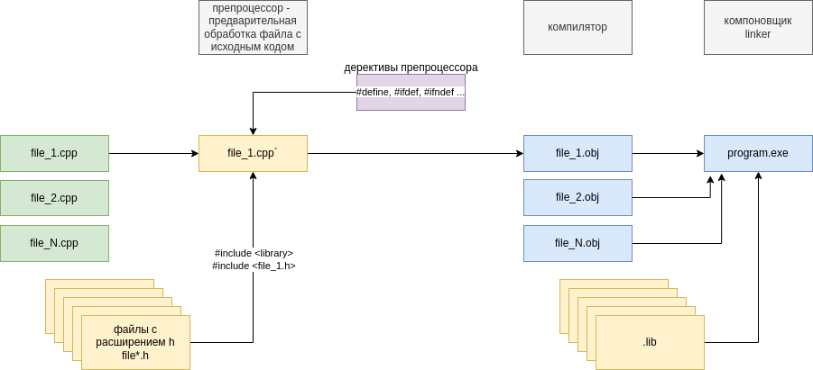

# Методичка к экзамену

## 1. Антипаттерны: Copy&Paste, спаггети-код

**Антипаттерн** — шаблон неэффективного решения задачи.

### Copy&Paste
- **Определение**: Создание кода с часто повторяющимися частями.
- **Последствия**:
  1. Дубликат кода усложняет восприятие программы и размножает ошибки из оригинала;
  2. Усложнение исправления ошибок, так как изменения нужно вносить во всех копиях.
- **Решение**:
  1. Код-ревью;
  2. Принцип DRY (Don't Repeat Yourself) — вынос общей логики в функции или классы;
  3. Рефакторинг.

**Пример антипаттерна**:
```cpp
int sumInt(const vector<int>& vec) {
    int sum = 0;
    for (int num : vec)
        sum += num;
    return sum;
}

double sumDouble(const vector<double>& vec) {
    double sum = 0.0;
    for (double num : vec)
        sum += num;
    return sum;
}

void main() {
    vector<int> intVec = {n values};
    vector<double> doubleVec = {n values};
    cout << "Sum int: " << sumInt(intVec) << endl;
    cout << "Sum double: " << sumDouble(doubleVec) << endl;
    return 0;
}
```
**Пример исправления**:
```cpp
template <typename T>
T sum(const vector<T>& vec) {
    T sum = T();
    for (const T& num : vec)
        sum += num;
    return sum;
}

void main() {
    vector<int> intVec = {n values};
    vector<double> doubleVec = {n values};
    cout << "Sum int: " << sum(intVec) << endl;
    cout << "Sum double: " << sum(doubleVec) << endl;
}
```
### Спаггети-код
- **Определение**: Сложный для понимания, слабо структурированный код.
- **Причины**:
  1. Множество связей (вложенные конструкции, goto, friend );
  2. Неявные зависимости.
- **Пример**:
```cpp
void f(int a, int b, int _x) {
    if (_x) {
        // another operation;
    } else {
        // another operation;
    }
}

void main() {
    f(1, 2, x);
    // something
    f(1, 2, x);
}
```

## 2. Антипаттерны. Магические числа, hard code, ненужная сложность 
### Магические числа
- **Определение**: Использование числовых констант в коде.
- **Пример**:
```cpp
int a = x * 8;
int b = c + 8;
float f = 34.593f;
float x = a * 34.6f;
```
- **Пример исправления**:
```cpp
const int NUM_ELEMENTS = 8;
const int NUM_BITS = 8;
const int ARRAY_SIZE = 10;
const float FVALUE = 34.59f;
// также можно использовать другой метод
const int NUM_BITS_INT = sizeof(int) * 8;
```
### Hard code
- **Определение**: Внедрение конкретных значений в код, вместо их вынесения в конфигурационные файлы, константы или базу данных.
- **Последствия**: усложнение поддержки и изменение программы.
- **Пример (условный)**:
```cpp
void connectToDB() {
    string host = "127.0.0.1";
    int port = 5432; //новость дня, postgres по умл предлагает вашу бд установить на этот порт
    string user = "admin";
    string password = "dayahuyznaet";
}

void main() {
    connectToDB();
}
```
- **Пример исправления** (смысл в выносе настроек в конфиг или иное окружение, а затем их подключить):
```cpp
// у нас например есть какое нибудь окружение, БД, есть метод getenv, который может обращаться к окружению
void connectToDatabase() {
    const char* host = getenv("DB_HOST");
    const char* portStr = getenv("DB_PORT");
    const char* user = getenv("DB_USER");
    const char* password = getenv("DB_PASS");
}

void main() {
    connectToDatabase();
} 
// смысл в том, чтобы данные не находились в исходниках
```

### Ненужная сложность (неоправданно универсальное решение)
- **Определение**: Намеренно усложненный код.
- **Причины**:
  1. Избыток абстракций, классов, паттернов;
  2. Ненужные уровни наследования;
  3. Гибкое решение там, где возможен простой код.
- **Пример**:
```cpp
// из проблем: 2 класса для простой проверки, виртуальный метод и динамическая память
class NumberValidator {
public:
    virtual bool validate(int) = 0;
    virtual ~NumberValidator() {}
};

class EvenNumberValidator : public NumberValidator {
public:
    bool validate(int num) override {
        return num % 2 == 0;
    }
};

void main() {
    NumberValidator* validator = new EvenNumberValidator();
    cout << validator->validate(4);
    delete validator;
}
```
- **Пример решения**:
```cpp
bool isEven(int num) {
    return num % 2 == 0;
}

void main() {
    cout << isEven(4);
}
```

## 3. Препроцессор-компилятор-компоновщик
- **Препроцессор** - программа для обработки текста. Он преобразует данные в соответствии с директивами препроцессора. Если данные не содержат директив препроцессора, то они остаются без изменений. Препроцессор может существовать как отдельная программа, так и быть интегрированным в компилятор.
- **Компилятор** - программа, которая переводит исходный код в инструкции процессора (как объектный файл, на схеме указано). При синтаксических ошибках объектный файл не создается.
- **Компоновщик** - на слэнге это линкер. Это программа, производящая линковку, сборку. Он принимает на вход один или несколько модулей и собирает по ним исполнимый модуль.

<p> В общем, это этапы процесса трансляции исходника в виде текстового файла в представлении, которое может быть выполнено процессором. </p>

**Сборка компоновщика**
<p> Всем известно, что сборка программы происходит за счет другой специальной программы - компоновщика. Роль компоновщика определяет размещение программы в памяти (ну распределение памяти в общем), также настраивает адреса в памяти: относительные адреса заменяются абсолютными адресами распределенной памяти.</p>



## 4. C++11. Список инициализации, лямбда функции
### Список инициализации
- **Определение**: единый синтаксис инициализации переменных, контейнеров и объектов с помощью {}.
- **Преимущества**:
  1. Универсальность (работает для всех типов: примитивы, массивы, классы, контейнеры);
  2. Ограничение преобразования (например: double -> int без явного приведения);
  3. Устранение неоднозначности при вызове конструкторов.
- **Пример**:
```cpp
int x{5};
double y{3.14};     

int arr[]{1, 2, 3};               
vector<int> vec{10, 20, 30}; 

class Point {
public:
    int x, y;
    Point(int a, int b) : x{a}, y{b} {}
};
Point p{1, 2};
```
- **Существует особенность**, если тип имеет <code>initializer_list</code> в конструкторе, то вызов происходит предпочтительно:
```cpp
vector<int> v{5}; // один элемент, равный 5
vector<int> v(5); // 5 элементов, равных 0
```

### Лямбда функция
- **Определение**: Такая функция, которую можно объявить непосредственно в месте использования (то есть объявляем и используем на лету). Также ее можно передавать в качестве параметра (пример с алгоритмом).
- **Пример 1**:
```cpp
// пример с простой лямбдой
vector<int> v = {1, 3, 5, 2, 4, 1, 5, 7, 4, 9, 3, 4};

for_each(
    v.begin(), 
    v.end(), 
    [](int x){cout << x << ' ';} // если что, то вот она
);
// у нее прикольный прикол, что используется на лету, а также, до этого момента, нестандартное начало объявления, где [] - захват переменной, смотри пример ниже. 
```
- **Пример 2**:
```cpp
// пример с захватом переменной
vector<int> v = {1, 3, 5, 2, 4, 1, 5, 7, 4, 9, 3, 4};
int summ = 0;
for_each(
    v.begin(), 
    v.end(),
    [&summ](int x){
        cout << x << ' ';
        summ += x;
    }
);
// [x] - захват по значению;
// [&x] - захват по ссылке.
```
- **Пример 3**:
```cpp
vector<int> nums{1, 2, 3, 4};
sort(nums.begin(), nums.end(), [](int a, int b) { return a > b; });
// в методе sort лямбда функция передается в качестве параметра.
```

## 5. C++11. auto, for по коллекции
### auto
- **Определение (из дипсика)**: механизм автоматического вывода типа переменной на этапе компиляции.
- **Преимущества**:
  1. упрощает код (в особенности с итераторами);
  2. Уменьшает вероятность ошибок при изменении типов;
  3. Работает с шаблонами и лямбда функциями.
- **Пример**:
```cpp
auto x = 5;          // int
auto y = 3.14;       // double
auto z = "Hello";    // const char*

vector<int> vec{1, 2, 3};
auto it = vec.begin();  // с этим каждый встречался не раз -> vector<int>::iterator

template <typename T, typename U>
auto add(T a, U b) -> decltype(a + b) {
    return a + b;
}
auto result = add(2, 3.5);  // double
```
В ней также есть прикол, что она требует явной инициализации, то есть просто объявить <code>auto x;</code> не получится, нужно указать значение. Двигаясь от C++20, auto можно использовать в передаваемых параметрах функций (код с дипсика ясно дает это понять). 

### for по коллекции
- ** Определение**: Упрощенный синтаксис для итерации по контейнерам. 
- **Преимущества**:
  1. Избавляет от ручного управления итератором (все же надеюсь помнят);
  2. Работает с любым типом, имеющий begin() и end();
  3. Поддерживает auto для краткости.
- **Пример**:
```cpp
//цикл for по коллекции
vector<int> v = {1, 2, 3};

for(auto it = v.begin(); it != v.end(); ++it)
    cout << *it << ' ';

cout << endl;

for(vector<int>::iterator it = v.begin(); it != v.end(); ++it)
    cout << *it << ' ';

cout << endl;

for(int& i : v)     //тот самый цикл for по коллекции в короткой записи
    cout << i << ' ';
/* объявляем тип итератора по коллекции, и саму коллекцию, 
работает с контейнерами у которых есть метды begin() и end(),
и их методы должны возвращать итератор.
с апперсантом i может менять значения контейнера, а без & просто для вывода.
auto упрощает запись, при этом необходимо знать что за тип,
и есть ли смысл упрощать запись */
```

## 6. Google Code Guide. Страж включения, зависимости в заголовочных файлах
### Страж включения
- **Определение**: условно это техника предотвращения множественного включения одного заголовочного файла в проект.
- **Как работает**: использует директивы препроцессора <code>#ifndef, #define, #endif</code> для блокировки повторного включения.
- **Пример:**  
```cpp
#ifndef MATRIX_H
#define MATRIX_H

class Matrix { /*...*/ };

#endif  // MATRIX_H
```
Для C++11 существует альтернатива: <code>#pragma once</code>.
Это модет быть важным, потому что возможно исключение ошибок переопределения функций и классов, а также исключает повторную обработку кода, что ускоряет компиляцию.

### Зависимости в заголовочных файлах
- **Определения нет, но**: не используйте <code>#include</code>, если достаточно предварительного объявления. Это в общем минимизирует зависимости, также можно включать только то, что нужно для объявления в заголовке.
- **Как разделяются зависимости**:
  1. Заголовочные файлы: только объявления, без реализации;
  2. Исходные файлы: полные <code>#include</code> для реализации.
- **Пример**:
```cpp
// какой нибудь My.h
#ifndef MY_H
#define MY_H
class X;
class Y {
    X* x;
public:
    Y();
    ~Y();
};
#endif
```
```cpp
// My.cpp
#include "My.h"

Y::Y(){x = new X();}
Y::Y(){delete x;}
void main(){}
```

## 7. Google Code Guide. Встроенные функции, порядок параметров


